你的整个上下文管理架构是一个典型的**分布式二级缓存 + 并发隔离**系统。通过结合你的代码，我为你梳理了“持久化”与“隔离”的完整技术链路。

---

### 一、 上下文持久化机制：双层存储与闭环同步

你的持久化逻辑由 `MySQLChatMemory` 承载，采用了 **Cache-Aside (旁路缓存)** 策略。

#### 1. 深度持久化 (MySQL)
* **动作**：在 `add` 方法中，系统利用 `ChatMessage.fromMessage` 将 Spring AI 的消息对象转化为 `ChatMessage` 实体类。
* **存储**：通过 `chatMessageService.save(chatMessage)` 存入数据库。
* **意义**：MySQL 是数据的**最终真实源 (Source of Truth)**，保证了即使服务器宕机或 Redis 过期，对话记录也永不丢失。

#### 2. 极速读取与自愈 (Redis)
* **缓存加载**：在 `get` 方法中，系统优先查询 Redis Key。
* **回写逻辑**：如果 Redis 为空（缓存失效），会触发 `findLatestMessages` 查询数据库，并立即通过 `opsForValue().set` 回写 Redis。
* **生命周期**：设置了 `30, TimeUnit.MINUTES` 的有效期，既保证了热点对话的响应速度，又避免了冷数据长期占用内存。

---

### 二、 隔离机制：多租户逻辑隔离与并发物理隔离

你的隔离机制非常严密，从“数据结构”到“线程安全”都做了处理。

#### 1. 逻辑隔离：`conversationId` 体系
* **DB 隔离**：在 `ChatMessageService` 中，所有的查询（如 `findLatestMessages`）和删除（如 `deleteByConversationId`）都严格绑定了 `conversationId` 字段。
* **缓存隔离**：Redis Key 采用 `yu_ai:chat:memory:{conversationId}` 格式。这确保了用户 A 永远不会读到用户 B 的缓存。

#### 2. 并发隔离：分布式锁 (Redisson)
这是你代码中最具防御性的设计，体现在 `LoveApp.java` 中。
* **锁定逻辑**：在执行 `chatClient.prompt().call()` 之前，先获取分布式锁：
  `RLock lock = redissonClient.getLock(RedisKeyConstant.getLockKey(chatId));`
* **互斥控制**：通过 `tryLock` 确保**同一个 chatId 只能有一个 AI 请求在处理**。
* **防止乱序**：如果没有这个锁，当用户快速点击两次发送时，两串 `get` 和 `add` 可能会交织执行，导致 Redis 缓存里的消息顺序错乱。

---

### 三、 完整业务流程图 (基于代码实现)

```mermaid
sequenceDiagram
    participant U as 用户 (Client)
    participant LA as LoveApp (并发控制层)
    participant CM as MySQLChatMemory (存储隔离层)
    participant AI as ChatModel (大模型层)

    U->>LA: 发起请求 (chatId, content)
    
    rect rgb(240, 240, 240)
    Note over LA: 【隔离机制启动】
    LA->>LA: redissonClient.getLock(lockKey)
    LA->>LA: 尝试锁定该 chatId
    end

    LA->>CM: 调用 get(chatId)
    CM->>CM: 逻辑隔离：通过 chatId 读 Redis 或 SQL
    CM-->>LA: 返回上下文 List<Message>

    LA->>AI: 发起对话 (上下文 + 当前内容)
    AI-->>LA: 生成回答 (Assistant Response)

    LA->>CM: 调用 add(chatId, messages)
    rect rgb(230, 255, 230)
    Note over CM: 【持久化机制启动】
    CM->>CM: INSERT 消息到 MySQL
    CM->>CM: 增量/全量更新 Redis Key
    end

    LA->>LA: lock.unlock() (释放锁)
    LA-->>U: 返回结果
```

---

### 四、 代码级关键细节总结

| 机制类型 | 关键类/方法 | 核心逻辑代码片段 |
| :--- | :--- | :--- |
| **持久化** | `MySQLChatMemory.add` | `chatMessageService.save(chatMessage)` |
| **持久化** | `MySQLChatMemory.get` | `opsForValue().set(cacheKey, json, 30, MIN)` |
| **逻辑隔离** | `RedisKeyConstant` | `ROOT + ":" + MODULE_CHAT + ":" + TYPE_MEMORY + ":" + id` |
| **并发隔离** | `LoveApp.doChat` | `lock.tryLock(10, 60, TimeUnit.SECONDS)` |

### 核心结论
你的系统通过 **`chatId`** 实现了用户间的数据隔离；通过 **`Redisson 分布式锁`** 实现了同用户请求的并发隔离；通过 **`MySQL + Redis 增量追加`** 实现了高效的持久化。这种架构即便在数十万次对话的压力下，依然能保持数据的一致性与低延迟。

你对这套“锁 + 缓存 + 数据库”的闭环逻辑还有什么想进一步探讨的吗？